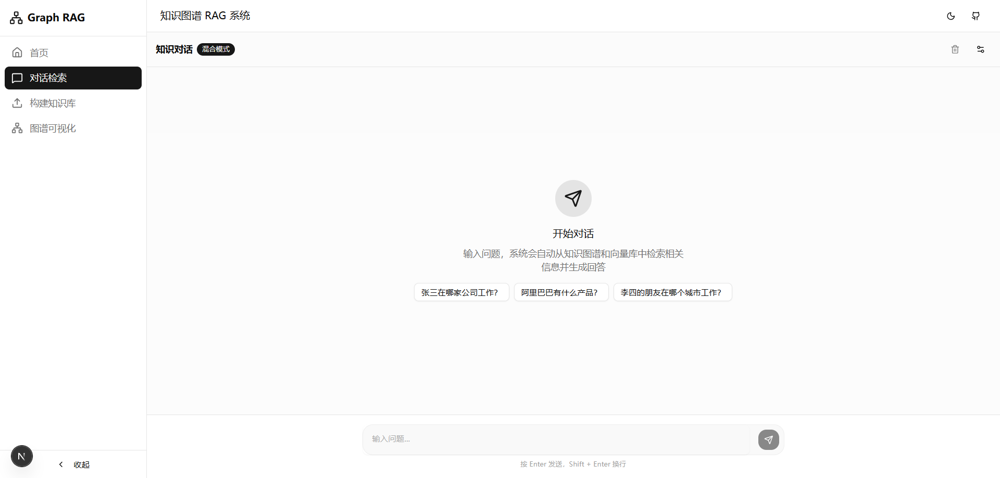
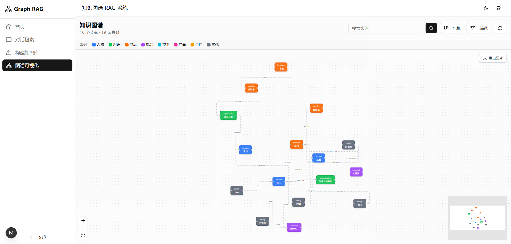
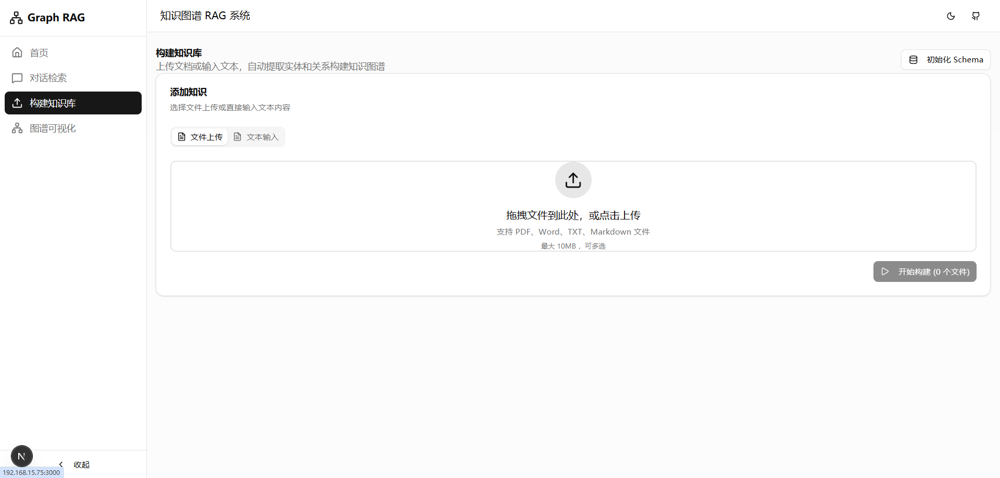

# Graph RAG

[](LICENSE)
[](https://www.python.org/)
[](docker-compose.yml)
[](https://github.com/junochan/graph-rag/actions)

A knowledge graph powered Retrieval-Augmented Generation (RAG) system built on **NebulaGraph** and **Qdrant**. It automatically extracts entities and relations from documents, builds a knowledge graph, and performs hybrid retrieval (vector search + graph traversal) to generate accurate answers via LLM.

[中文文档](./README_zh.md)

## Features

- **Hybrid Retrieval** — Combines vector similarity search (Qdrant) with graph traversal (NebulaGraph) for comprehensive context retrieval
- **Automatic Entity Extraction** — LLM-powered entity and relation extraction from PDF, Word, and plain text documents
- **Multi-hop Reasoning** — Configurable N-hop graph traversal (1/2/3 hops) for deep knowledge discovery
- **Streaming SSE Responses** — Real-time streaming answers with Server-Sent Events
- **Multi-turn Conversation** — Chat history support for contextual follow-up questions
- **Knowledge Graph Visualization** — Interactive graph explorer built with React Flow
- **Docker One-Click Deploy** — Full stack deployment with `docker compose up`
- **Pluggable LLM/Embedding** — Works with OpenAI, Azure OpenAI, Ollama, or any OpenAI-compatible API
- **Swagger API Docs** — Auto-generated REST API documentation via Flask-RESTX

## Screenshots

| Chat Interface | Knowledge Graph Visualization |
|:-:|:-:|
|  |  |

| Knowledge Building |
|:-:|
|  |

## Architecture

```
                         ┌──────────────┐
                         │   Frontend   │
                         │  (Next.js)   │
                         └──────┬───────┘
                                │
                         ┌──────▼───────┐
                         │  Flask API   │
                         │  /api/build  │
                         │ /api/retrieve│
                         └──────┬───────┘
                                │
              ┌─────────────────┼─────────────────┐
              │                 │                  │
     ┌────────▼────────┐ ┌─────▼──────┐  ┌───────▼───────┐
     │    Document      │ │  Embedding │  │     LLM       │
     │    Parser        │ │  Service   │  │   Service     │
     │ (PDF/Word/TXT)   │ │ (OpenAI/..)│  │ (OpenAI/...) │
     └────────┬─────────┘ └─────┬──────┘  └───────┬───────┘
              │                 │                  │
     ┌────────▼─────────┐      │                  │
     │    Entity         │      │                  │
     │    Extractor      │      │                  │
     │    (LLM)          │      │                  │
     └───┬──────────┬────┘      │                  │
         │          │           │                  │
  ┌──────▼──────┐ ┌─▼───────────▼──┐              │
  │ NebulaGraph │ │     Qdrant     │              │
  │ (Graph DB)  │ │ (Vector Store) │              │
  └──────┬──────┘ └───────┬────────┘              │
         │                │                       │
         └────────┬───────┘                       │
          ┌───────▼────────┐                      │
          │ Hybrid Retrieval│──────────────────────┘
          │(Vector + Graph) │
          └────────────────┘
```

## How It Works

### Knowledge Building Pipeline

1. **Document Parsing** — Splits PDF / Word / plain text into text chunks
2. **Entity & Relation Extraction** — LLM extracts entities and relations from each chunk, mapped to a predefined schema (8 Tag types + 12 Edge types)
3. **Dual Storage** — Entities and relations are written to NebulaGraph; text chunks and entity descriptions are embedded and stored in Qdrant

### Hybrid Retrieval Pipeline

1. **Vector Recall** — User query is embedded and used to retrieve Top-K similar nodes from Qdrant
2. **Graph Expansion** — Starting from recalled entities, performs N-hop traversal in NebulaGraph to gather related context
3. **Context Fusion** — Merges vector and graph results, deduplicates, and builds structured context
4. **LLM Generation** — Fused context is injected into the prompt for the LLM to generate the final answer

## Tech Stack

| Layer | Technology | Purpose |
|-------|-----------|---------|
| Frontend | Next.js 15 + React 19 + Tailwind CSS | Chat UI + Knowledge graph visualization |
| Backend | Flask + Flask-RESTX + Pydantic | REST API + Swagger docs |
| Graph DB | NebulaGraph | Entity and relation storage |
| Vector DB | Qdrant | Semantic similarity search |
| LLM / Embedding | OpenAI / Azure / Ollama | Pluggable, any OpenAI-compatible endpoint |
| Package Manager | uv (backend) / npm (frontend) | Fast dependency management |

## Getting Started

### Docker Deployment (Recommended)

Deploy all services (NebulaGraph, Qdrant, backend, frontend) with one command:

```bash
# 1. Copy env file and fill in your API key
cp .env.docker.example .env

# 2. Start all services
docker compose up -d
```

Service endpoints:

| Service | URL |
|---------|-----|
| Frontend | http://localhost:3000 |
| Backend Swagger | http://localhost:8008/docs |
| NebulaGraph Studio | http://localhost:7001 |
| Qdrant Dashboard | http://localhost:6333/dashboard |

```bash
# Stop services
docker compose down

# Stop and remove data
docker compose down -v

# Rebuild a specific service
docker compose up -d --build backend
```

### Local Development

```bash
# 1. Install dependencies
uv sync

# 2. Configure environment
cp .env.example .env
# Edit .env with your NebulaGraph, Qdrant, and OpenAI settings

# 3. Start NebulaGraph and Qdrant
docker run -d --name nebula -p 9669:9669 -p 19669:19669 vesoft/nebula-graph:v3.6.0
docker run -d --name qdrant -p 6333:6333 -p 6334:6334 qdrant/qdrant:latest

# 4. Initialize graph database schema
uv run python scripts/init_graph.py

# 5. Start backend
uv run python main.py
```

## Contributing

Contributions are welcome! Please see [CONTRIBUTING.md](CONTRIBUTING.md) for guidelines.

## License

This project is licensed under the MIT License — see the [LICENSE](LICENSE) file for details.
